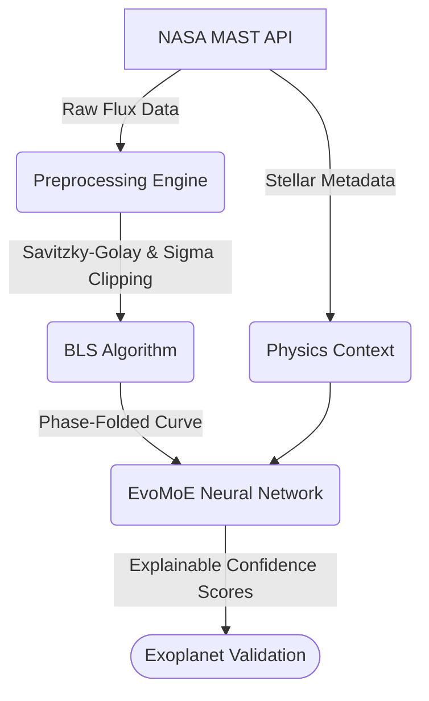

# AstroVerse 🔭

[](https://github.com/mahik504/AstroVerse/actions/workflows/ci.yml)
[](https://www.python.org/downloads/release/python-3110/)
[](https://opensource.org/licenses/MIT)

**AI-Powered Exoplanet Transit Detection using Mixture-of-Experts Architecture on NASA TESS Data**

AstroVerse is an open-source, modular research platform for automated exoplanet detection. It combines a novel neural network architecture (**EvoMoE**) with a full-stack scientific dashboard (**AstroLens**).

## Architecture Overview



### Project Structure

```text
AstroVerse/
├── apps/astrolens-web/     # Next.js 16 scientific dashboard
├── research/evonex/        # PyTorch EvoMoE model + training pipeline
│   ├── configs/            # YAML experiment configurations
│   ├── experiments/        # Tracked training runs and metrics
│   ├── src/                # Model, dataset, and preprocessing code
│   └── tests/              # PyTest test suite
├── services/evonex-api/    # FastAPI inference server
└── docs/                   # Documentation (Architecture, API, Reproducibility)
```

## Quick Start

We provide a `Makefile` for streamlined developer ergonomics.

### Prerequisites
- Python 3.11+
- Node.js 18+

### Installation
```bash
make install
```

### Testing
Run the model, preprocessing, and API test suites:
```bash
make test
```
Smoke test the model architecture:
```bash
make smoke
```

### Running the Platform
Start the FastAPI backend:
```bash
make dev-api
```
Start the Next.js frontend (in a separate terminal):
```bash
make dev-web
```
Open [http://localhost:3000](http://localhost:3000)

## Research Workflow

To train the EvoMoE model using our tracked experiment pipeline:

```bash
cd research/evonex
# Train with the small config (quick test)
python src/train_evomoe.py --config configs/small.yaml

# Train with the full paper config
python src/train_evomoe.py --config configs/paper.yaml
```
Check `research/evonex/experiments/` for logged metrics, configs, and model weights.

## Documentation

For a deep dive into the scientific and engineering principles of AstroVerse, see our documentation:

- **[Architecture](docs/ARCHITECTURE.md)** — EvoMoE math, expert routing, and data flow.
- **[API Reference](docs/API.md)** — FastAPI endpoints and usage.
- **[Reproducibility](docs/REPRODUCIBILITY.md)** — How to recreate our experiments.
- **[Research Status](docs/RESEARCH_STATUS.md)** — Current capabilities and limitations.
- **[Model Card](docs/Model_Card.md)** / **[Dataset Card](docs/Dataset_Card.md)** — Details on EvoMoE and the STScI xCTL.

## Contributing
We welcome contributions! Please see [CONTRIBUTING.md](docs/CONTRIBUTING.md) for our code style (ruff, ESLint), PR templates, and testing requirements.

## Citation

If you use AstroVerse or EvoMoE in your research, please cite:

```bibtex
@software{AstroVerse2026,
  author = {Mahi K},
  title = {AstroVerse: Adaptive Mixture-of-Experts for Exoplanet Detection},
  year = {2026},
  url = {https://github.com/mahik504/AstroVerse}
}
```

## License
This project is licensed under the MIT License. See [LICENSE](LICENSE).

## Acknowledgments
- NASA TESS mission and the MAST archive
- STScI for the TIC and CTL catalogs
