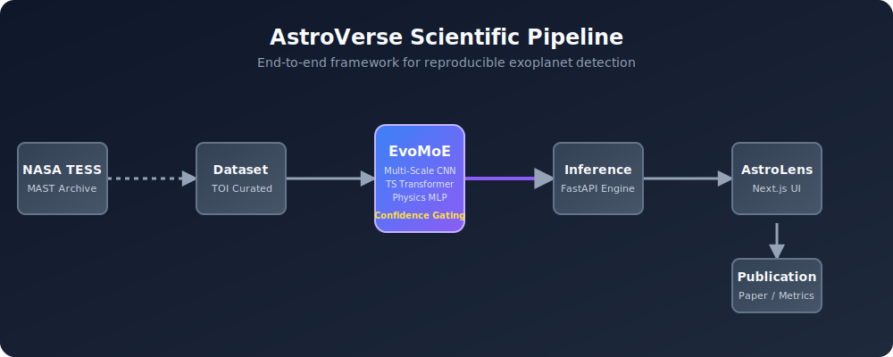

# AstroVerse 🔭

[](https://github.com/mahik504/AstroVerse/actions/workflows/ci.yml)
[](https://www.python.org/downloads/release/python-3110/)
[](https://opensource.org/licenses/MIT)

**AstroVerse is an open-source, reproducible exoplanet detection pipeline powered by an explainable Mixture-of-Experts (EvoMoE) neural architecture.**

The core problem in automated transit detection is that deep learning models operate as "black boxes"—astrophysicists cannot trust a model if it cannot explain *why* it flagged a signal. AstroVerse introduces **EvoMoE**, which explicitly routes TESS light curves between morphological (CNN), temporal (Transformer), and physical (MLP) experts, predicting if a signal is a planet while explaining its exact reasoning.

---

### Architecture


---

### AstroLens UI Demo
*[Placeholder: Animated GIF of AstroLens UI processing a NASA TESS Target]*

---

## ⚡ Quick Start

You don't need a GPU to evaluate AstroVerse. We provide a streamlined `Makefile` that downloads real NASA TESS data, runs the empirical baselines, and launches the dashboard.

```bash
# 1. Install Dependencies
make install

# 2. Run the end-to-end dataset generation and baseline evaluation
make demo

# 3. Launch the API and Next.js Dashboard
make dashboard
```
Open [http://localhost:3000](http://localhost:3000) to view the detection mission control.

---

## 🔬 Current Research Status (v1.0.0-research)

AstroVerse is currently in the **Research Execution Phase**. The software engineering feature-freeze is active while we execute empirical benchmarking.

* **Implemented:** Full AstroLens Next.js UI, FastAPI inference engine, EvoMoE PyTorch model, MAST automated ingestion, Box Least Squares phase-folding.
* **Currently Executing:** Evaluating EvoMoE against classical baselines on the `v2-curated-500` dataset.
* **Future Work:** Scaling to `v4-paper-10000` (10,000 targets) and arXiv publication.

See our [ROADMAP.md](docs/ROADMAP.md) for detailed progress.

---

## 📊 Empirical Benchmarks
*(AstroVerse is currently in the empirical benchmarking phase. Baseline evaluations against Classical BLS, 1D CNN, ResNet, and Transformers on the `v2-curated-500` dataset are actively running. Real metrics will be published here upon completion. EvoMoE full results will follow the `v4-paper-10000` distributed training run.)*

---

## 📂 Repository Structure

```text
AstroVerse/
├── apps/astrolens-web/     # Next.js 16 UI (Mission Control Dashboard)
├── services/evonex-api/    # FastAPI Inference Engine
├── research/evonex/        # PyTorch Model, Training, and Evaluation Pipeline
├── paper/                  # LaTeX Academic Manuscript
└── docs/                   # Scientific Documentation & Reproducibility Guides
```

For onboarding, please read the [Project Overview](docs/PROJECT_OVERVIEW.md).

---

## 📚 Documentation
For a deep dive into the scientific and engineering principles of AstroVerse:
- **[Project Overview](docs/PROJECT_OVERVIEW.md)** — Onboarding guide and file-by-file breakdown.
- **[Architecture](docs/ARCHITECTURE.md)** — EvoMoE math, expert routing, and data flow.
- **[API Reference](docs/API.md)** — FastAPI endpoints and usage.
- **[Reproducibility](docs/REPRODUCIBILITY.md)** — How to recreate our experiments.
- **[Model Card](docs/MODEL_CARD.md)** / **[Dataset Card](docs/DATASET_CARD.md)** — Details on EvoMoE and the dataset bias.

## 🤝 Contributing
We welcome contributions! Please see [CONTRIBUTING.md](docs/CONTRIBUTING.md) for our code style (ruff, ESLint), PR templates, and testing requirements.

## 📝 Citation
If you use AstroVerse or EvoMoE in your research, please cite:
```bibtex
@software{AstroVerse2026,
  author = {Mahi K},
  title = {AstroVerse: Adaptive Mixture-of-Experts for Exoplanet Detection},
  year = {2026},
  url = {https://github.com/mahik504/AstroVerse}
}
```
