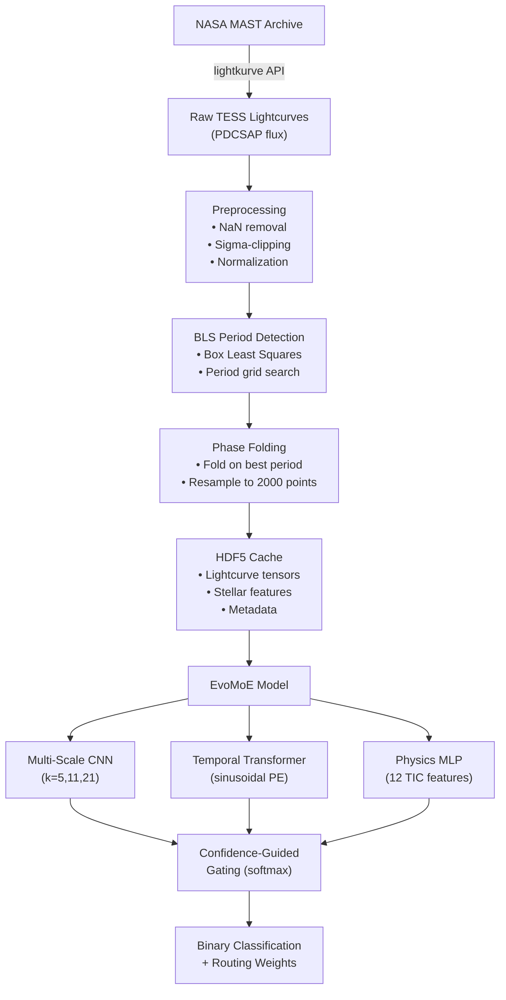

# EvoMoE Architecture

> Evolutionary Mixture-of-Experts for exoplanet transit detection in NASA TESS lightcurves.

## Overview

EvoMoE is a Mixture-of-Experts (MoE) architecture that decomposes exoplanet transit detection into three specialized sub-problems, each handled by a dedicated expert network. A confidence-guided gating network fuses expert outputs into a single binary classification.

**Model summary:**

| Property | Value |
|---|---|
| Trainable parameters | 1,485,605 |
| Lightcurve input shape | `(batch, 2000)` |
| Stellar feature input shape | `(batch, 12)` |
| Output | Binary classification + routing weights |
| Training status | Architecture validated; large-scale training pending |

---

## Expert Networks

### 1. Multi-Scale CNN — Local Transit Morphology

Extracts transit shape features at multiple temporal resolutions using parallel 1D convolutions with kernel sizes **k ∈ {5, 11, 21}**. Small kernels capture sharp ingress/egress edges; large kernels capture broad, shallow transits.

- Input: `(batch, 1, 2000)` — phase-folded lightcurve
- Each branch: `Conv1d → BatchNorm → ReLU → AdaptiveAvgPool1d`
- Outputs are concatenated and projected to a shared embedding dimension

### 2. Temporal Transformer — Global Periodicity

Captures long-range periodic dependencies via self-attention over the lightcurve sequence.

- Input: `(batch, seq_len, d_model)`
- **Sinusoidal positional encoding** injects temporal order information
- Multi-head self-attention followed by feedforward layers
- Learns repeating transit patterns across the full observation window

### 3. Physics MLP — Stellar Parameter Validation

Validates transit candidates against stellar physics using 12 features from the TESS Input Catalog (TIC):

> `Teff`, `logg`, `radius`, `mass`, `metallicity`, `density`, `distance`, `Tmag`, `ra`, `dec`, `eclong`, `eclat`

- Input: `(batch, 12)`
- Architecture: `Linear → ReLU → Dropout → Linear → ReLU → Linear`
- Encodes astrophysical priors (e.g., a 0.1 R☉ star cannot host a Jupiter-radius transit at the observed depth)

---

## Confidence-Guided Gating

The gating network produces a routing weight vector **w** over the three experts using a softmax over learned confidence scores:

$$
w_i = \frac{\exp(g_i)}{\sum_{j=1}^{3} \exp(g_j)}
$$

where **g_i** is the raw gating logit for expert *i*, computed from the concatenation of all expert embeddings:

$$
\mathbf{g} = W_g \cdot [\mathbf{h}_{\text{CNN}}; \mathbf{h}_{\text{Transformer}}; \mathbf{h}_{\text{MLP}}] + b_g
$$

The final prediction is:

$$
\hat{y} = \sigma\left(\sum_{i=1}^{3} w_i \cdot f_i(\mathbf{h}_i)\right)
$$

where **f_i** is each expert's classification head and **σ** is the sigmoid function.

The routing weights **w** are exposed at inference time for interpretability — they indicate which expert the model relied on most for each prediction.

---

## Data Flow



### Pipeline Steps

1. **Download** — Fetch PDCSAP lightcurves from MAST via `lightkurve.search_lightcurve()`
2. **Preprocess** — Remove NaNs, apply sigma-clipping for outlier rejection, normalize flux to zero-median
3. **BLS** — Run Box Least Squares to detect periodic transit signals; extract best-fit period, epoch, duration
4. **Phase-fold** — Fold lightcurve on BLS period; resample to fixed 2000-point vector
5. **Cache** — Store processed tensors and TIC stellar parameters in HDF5 for fast training I/O
6. **Inference** — Feed lightcurve tensor and stellar features through EvoMoE; output transit probability and expert routing weights

---

## Project Layout

```
apps/astrolens-web/    → Next.js 16 dashboard (visualization, results)
services/evonex-api/   → FastAPI inference API (serves predictions)
research/evonex/       → PyTorch EvoMoE model + training scripts
docs/                  → This documentation
```
