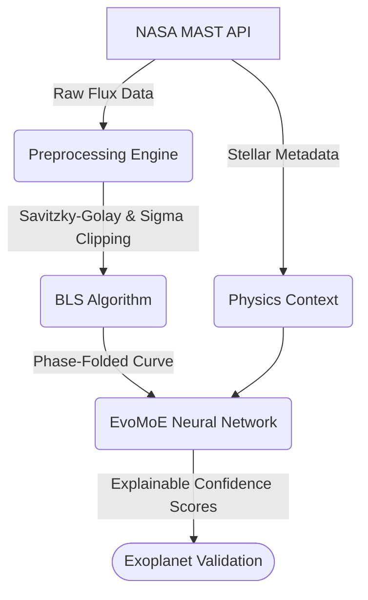

# EvoNex: Bharatiya Antariksh Hackathon 2026 Presentation Content

---

## Slide 1: Title Slide
**Team Name:** EvoNex
**Team Leader Name:** [Your Name]
**Problem Statement:** Automated Discovery and Validation of Exoplanets from NASA TESS Light Curves using Multimodal Deep Learning.

---

## Slide 2: Team Members
**Team Leader:**
Name: [Your Name]
College: [Your College]

**Team Member-1:**
Name: [Member 1 Name]
College: [Member 1 College]

**Team Member-2:**
Name: [Member 2 Name]
College: [Member 2 College]

**Team Member-3:**
Name: [Member 3 Name]
College: [Member 3 College]

---

## Slide 3: Opportunity

**How different is it from existing approaches?**
Standard exoplanet detection uses single "black box" CNNs that only analyze transit shape. EvoNex uses an **Explainable Mixture-of-Experts (EvoMoE)** — three specialized AI models running in parallel (CNN for transit shape, Transformer for orbital rhythm, Physics MLP for stellar validation) with dynamic confidence-based routing.

**How will it solve the problem?**
It preprocesses raw TESS telemetry (detrending, sigma-clipping), extracts transit parameters using Box Least Squares (BLS), and validates each detection against the physical properties of the host star using TIC metadata.

**USP of the proposed solution:**
**Explainability.** The Confidence-Guided Gating outputs exact contribution percentages for each expert, telling researchers *why* a classification was made — not just *what* the classification is.

---

## Slide 4: Features

1. **Automated Noise Removal:** Savitzky-Golay detrending and sigma-clipping for space instrument artifacts.
2. **Mathematical Period Extraction:** Box Least Squares (BLS) algorithm for orbital period and transit duration.
3. **Dynamic API Integration:** Real-time stellar parameter fetching from NASA MAST archive via TIC queries.
4. **Adaptive Explainability:** Per-prediction expert routing weights showing decision rationale.

> **Visual:** Screenshot of the cleaned detrended flux graph from `notebooks/01_EDA_and_Preprocessing.ipynb`.

---

## Slide 5: Process Flow

---

## Slide 6: Wireframes

> **Visual:** Screenshot of the expert routing pie chart from `notebooks/04_EvoMoE_Explainability.ipynb`.
>
> **Caption:** "The EvoMoE Gating Network outputting its decision routing in real-time."

---

## Slide 7: Architecture

**The EvoMoE Architecture:**
1. **Input 1: Phase-Folded Flux (2000 points)**
   - Routes to **Multi-Scale CNN Expert:** 3 parallel kernel sizes (5, 11, 21).
   - Routes to **Temporal Transformer Expert:** Sinusoidal positional encoding + multi-head attention.
2. **Input 2: 12 Normalized Stellar Parameters (TIC Data)**
   - Routes to **Physics MLP Expert:** Validates transit depth against stellar mass/radius.
3. **Confidence-Guided Gating:**
   - Softmax over confidence logits → weighted embedding fusion → binary classification.

---

## Slide 8: Technologies

- **Core AI:** PyTorch (CNN, Transformer, MLP)
- **Astronomical Data:** Lightkurve (TESS/Kepler), Astroquery (MAST API)
- **Signal Processing:** SciPy (Savitzky-Golay), Astropy (BLS)
- **Data Storage:** HDF5 (h5py) for tensor caching
- **Frontend:** Next.js 16, Tailwind CSS v4, Recharts
- **Backend:** FastAPI, Uvicorn
- **Visualization:** Matplotlib, Jupyter Lab

---

## Slide 9: Implementation Cost

**Software & Licensing: ₹0 (Fully Open-Source)**
All tools (Python, PyTorch, Lightkurve) and NASA TESS data are free and open-source.

**Compute (Production Scale):**
- Inference runs on a standard laptop CPU.
- Training on the full TOI catalog requires cloud GPU infrastructure.
- Estimated cloud cost: ~$200-500 USD for a single large-scale training run.

---

## Slide 10: Thank You
